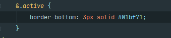
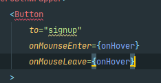
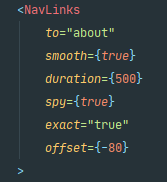

# React & SmoothScroll

### 처음알게된 정보
- styled-component Active 사용법 

- mouse 이벤트 처리
 
- react-scroll 사용해서 smooth-scroll
 

## 찾아볼것 
- sans-serif
- justify-self
- grid-template-areas
- grid-auto-columns: minmax(auto, 1fr); (minmax)
- justify-self: start;